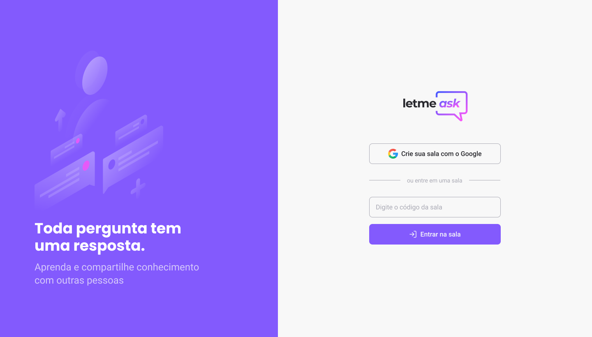
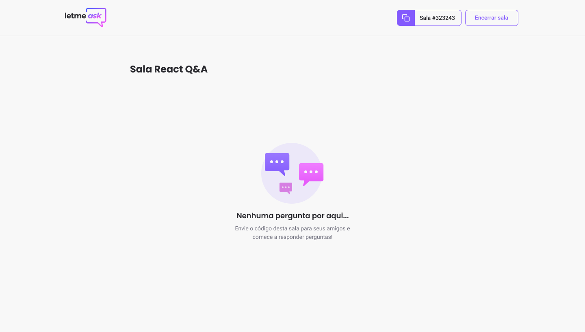
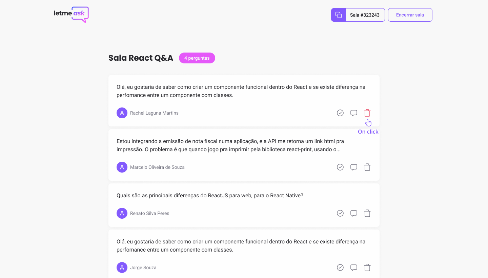
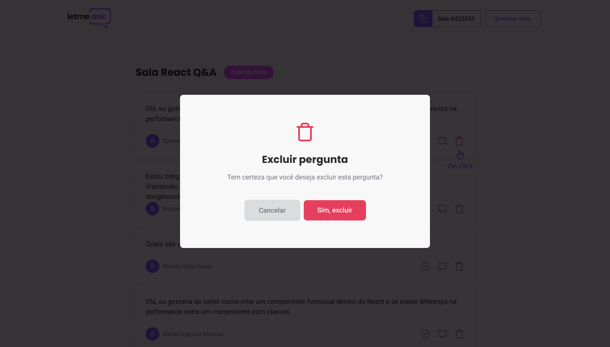
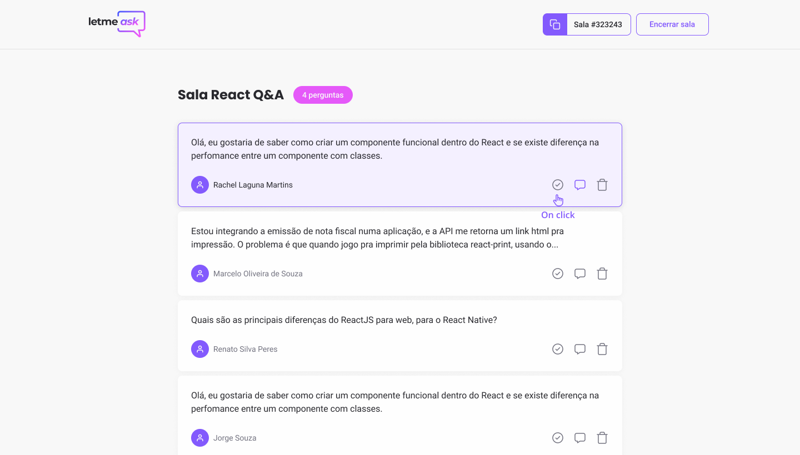
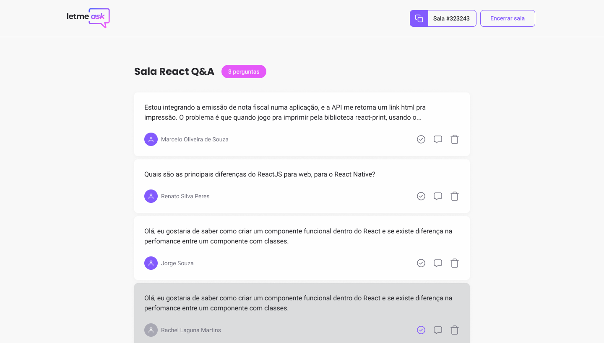
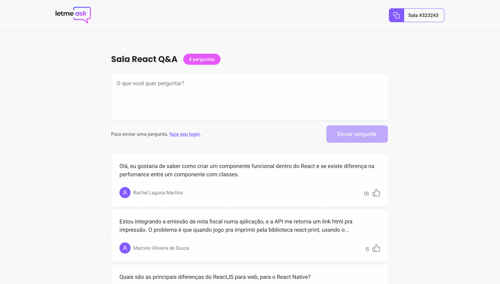

 <a href="#rocket-letmeask">Letmeask</a> •
 <a href="#arrow_forward-run">Run</a> •
 <a href="#hammer_and_wrench-technologies">Technologies</a> •

## :rocket: **Letmeask**

App developed during Rocketseat's NLW together!
This project is divided into two parts: 
- Admin
- User

## Admin
 
  

    <kbd></kbd>  
    <kbd></kbd> 
  

    

    <kbd></kbd>  
    <kbd></kbd> 
  

   

    <kbd></kbd>  
    <kbd></kbd> 
  

  ## User View
  

    <kbd></kbd>  
    <kbd></kbd> 
  

---
## :arrow_forward: **Run**

To run the project you need to clone or download this repository, have the Node Package Manager (NPM) or the YARN Package Manager installed (YARN).
### `yarn start`

---
## :hammer_and_wrench: **Technologies**

The following tools is used to build this project:

|:globe_with_meridians: Web|:file_cabinet: Server|
|:---:|:---:|
|ReactJS|Firebase|
|TypeScript|

